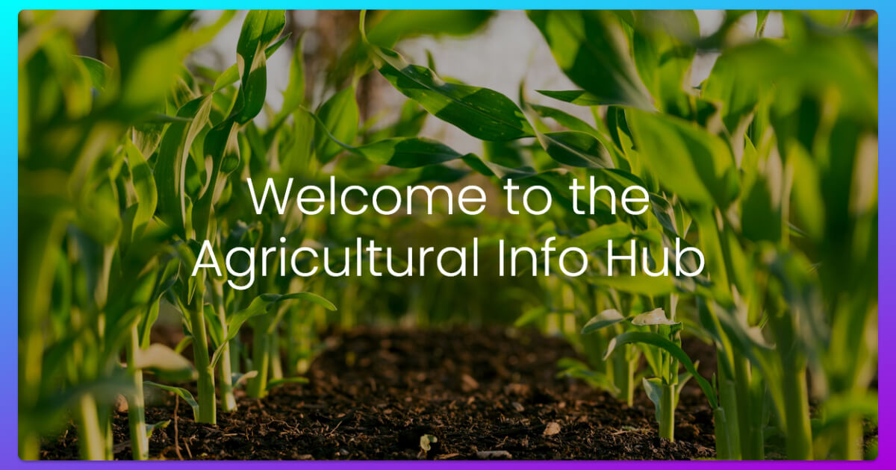

# Agricultural Info Hub 🌾

A comprehensive agricultural information platform designed to provide farmers and agricultural enthusiasts with essential knowledge about farming techniques, crop management, and pest control strategies.



## 🛠️ Technologies Used

- **HTML5**: Semantic markup and structure
- **CSS3**: Custom styling and animations
- **Bootstrap 5**: Responsive framework and components
- **JavaScript**: Interactive functionality

## 📱 Responsive Design

The website is fully responsive and optimized for:

- **Desktop**: 1200px and above
- **Tablet**: 768px to 1199px
- **Mobile**: 320px to 767px

## 🌟 Features

### 🏠 Homepage

- **Hero Section**: Eye-catching introduction with beautiful farming imagery
- **Navigation**: Easy-to-use navigation menu with quick access to all sections
- **Responsive Design**: Optimized for all devices (desktop, tablet, mobile)

### 📚 Farming Guides

- **Seasonal Categories**: Information organized by seasons (Summer, Monsoon, Winter)
- **Crop Types**: Detailed guides for various crops.
- **Interactive Cards**: Visual crop cards with hover effects and detailed links

### 🌱 Crop Details

- **Comprehensive Categories**:
  - **Grains**: Complete information about grain crops
  - **Fruits**: Fruit cultivation guides and techniques
  - **Vegetables**: Vegetable farming best practices
  - **Cash Crops**: Commercial crop cultivation strategies
- **Expert Opinions**: Professional insights and recommendations

### 🐛 Pest Control Strategies

- **Integrated Pest Management (IPM)**: Sustainable pest control approaches
- **Biological Control Methods**: Natural pest control solutions
- **Crop Rotation**: Strategic crop rotation techniques
- **Mechanical Controls**: Physical pest management tools
- **Botanical Pesticides**: Plant-derived pest control solutions
- **Physical Barriers**: Exclusion techniques and protective measures
- **Digital Monitoring**: Advanced sensor and drone-based pest detection

## 🚀 Getting Started

### Installation

1. **Clone the repository**:

   ```bash
   git clone https://github.com/CodeWithAlamin/Agricultural-Info-Hub.git
   ```

2. **Navigate to the project directory**:

   ```bash
   cd Agricultural-Info-Hub
   ```

3. **Open the website**:

   - Simply open `index.html` in your preferred web browser
   - Or use a local server for better development experience:

4. **Access the website**:
   - Direct file: `file:///path/to/index.html`
   - Local server: `http://localhost:8000`

## 📁 Project Structure

```
Agricultural-Info-Hub/
├── index.html
├── style.css
├── README.md
├── Licence.md
├── assets/
│   ├── images/
│   └── libs/
│       ├── bootstrap.min.css
│       └── bootstrap.bundle.min.js
└── pages/
    ├── contact.html
    ├── crop-details.html
    ├── crop-tomato.html
    ├── grain-crops.html
    ├── guides.html
    └── pest-control.html
```

## 📄 License

This project is licensed under the Apache License V2.0 - see the [Licence.md](Licence.md) file for details.

## Author

**Alamin**


I'm **Alamin**, a passionate web developer constantly learning and building projects. Connect with me on LinkedIn and Twitter.

- Website: [codewithalamin.com](https://codewithalamin.com)
- GitHub: [@CodeWithAlamin](https://github.com/CodeWithAlamin)
- LinkedIn: [CodeWithAlamin](https://www.linkedin.com/in/CodeWithAlamin)
- X (Twitter): [CodeWithAlamin](https://twitter.com/CodeWithAlamin)

---

**Made with ❤️ for the agricultural community**
